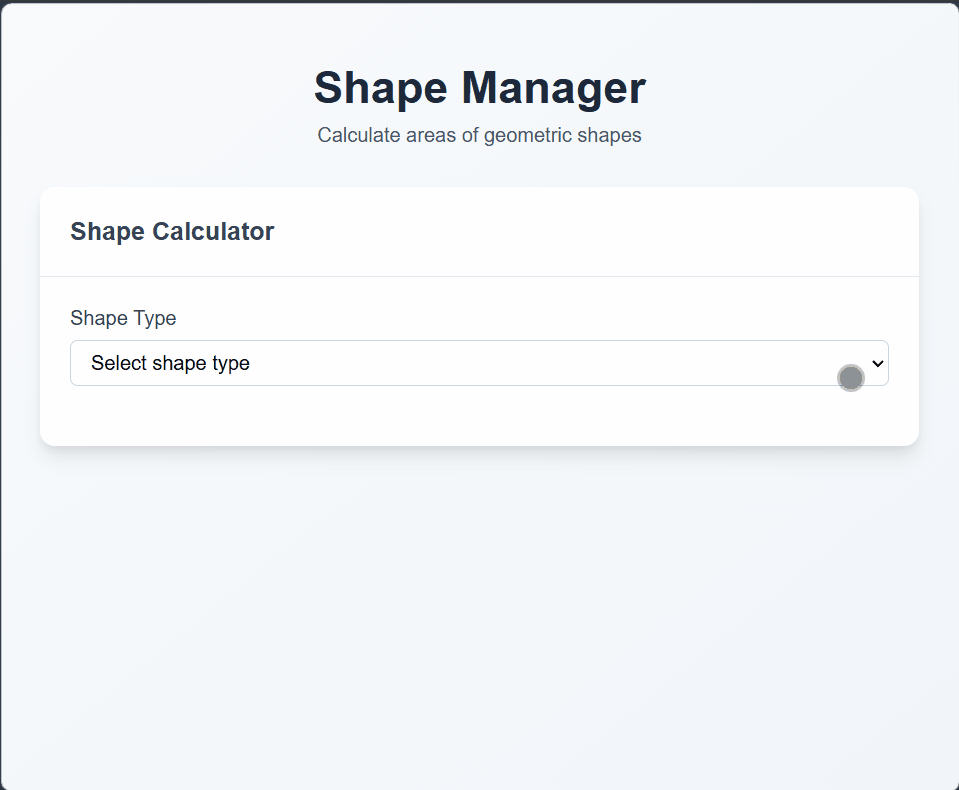

# 📐 Shape Manager

An interactive web app built with **TypeScript, HTML, and CSS** to practice core programming fundamentals. The app allows users to input dimensions and calculate the area of common shapes:

- Circle
- Rectangle
- Triangle

---

## 🚀 Live Demo

[View Project](https://himanshu-kumar-2301.github.io/fcc-shape-manager)

---

## 🛠️ Tech Stack

- **HTML5** (structure)
- **CSS3** (styling)
- **TypeScript** (logic)
- **Vite** (bundler & dev server)

---

## 📸 Preview



---

## 📚 Features

- **TypeScript practice**: Strongly typed functions for shape calculations.
- **Interactive UI**: Simple form inputs for each shape.
- **Real‑time results**: Instant area calculation on submission.
- **Clean modular code**: Organized in src/ with TypeScript configuration.

---

## 📂 Project Structure

```code
root/
|--public/
|--src/
|  |--style.css
|  |--main.ts
|  └──assets/
|     └──screenshot.gif
|--index.html
|--package.json
|--vite.config.ts
|--tsconfig.json
|--README.md
```

---

## ⚡ Getting Started

1. Clone the repo:

    ```bash
    git clone https://github.com/Himanshu-Kumar-2301/fcc-shape-manager.git
    ```

2. Navigate into the folder

    ```bash
    cd fcc-shape-manager
    ```

3. Install dependencies

    ```bash
    npm install
    ```

4. Start the dev server

    ```bash
    npm run dev
    ```

---

## 📖 Learning Goals

- Practice TypeScript basics (types, functions, interfaces).
- Strengthen DOM manipulation skills.
- Build confidence with modular project structure.

---

## 🌟 Future Improvements

- Add **perimeter calculations**.
- Support more shapes (e.g., square, trapezoid, polygon).
- Improve UI with **TailwindCSS or Bootstrap**.
- Add **unit tests** for calculation functions.

---
